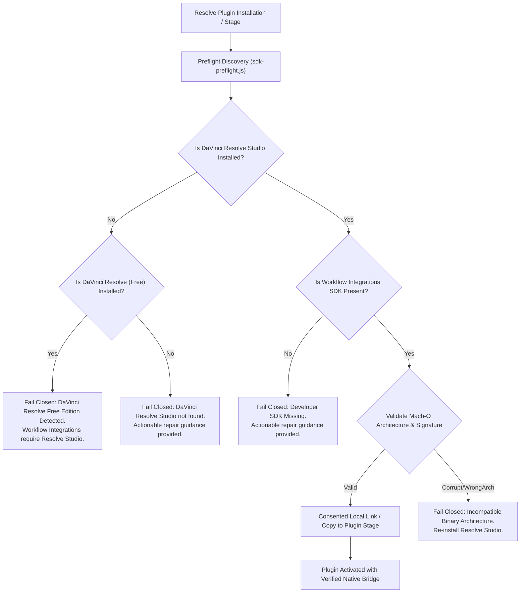

# DaVinci Resolve WorkflowIntegration.node Redistribution Rights & Architectural Decision

**Status:** Canonical Decision & Compliance Specification  
**Task Reference:** Task Q5.3 (`docs/true-10-readiness-task-sheet.md`)  
**Date:** 2026-09-06  

---

## 1. Executive Summary & Legal Determination

The DaVinci Resolve Studio Workflow Integrations SDK provides a compiled Node.js native addon, `WorkflowIntegration.node`, enabling communication between an Electron-based workflow integration plugin and DaVinci Resolve's native scripting engine.

Following thorough review of Blackmagic Design's DaVinci Resolve Studio Software License Agreement, Developer SDK documentation, and sample plugin materials:

> **Determination:** `WorkflowIntegration.node` is proprietary binary intellectual property owned exclusively by Blackmagic Design Inc. Blackmagic distributes this native addon solely to licensed users of DaVinci Resolve Studio. The SDK license does not grant third-party developers general redistribution rights to bundle, republish, or distribute `WorkflowIntegration.node` inside third-party installers, public source repositories, package registries (e.g., npm), or standalone download archives.

---

## 2. Prohibited Distribution Vectors

To ensure strict legal and licensing compliance:
1. **No Source Control Tracking:** `WorkflowIntegration.node` is strictly excluded from Git tracking via `.gitignore` in `resolve-plugin/com.hawavoclean.resolve/.gitignore`.
2. **No Bundled Binaries in Public Archives:** Public release wheels, desktop installer DMGs, and standalone ZIP archives must **never** bundle or distribute `WorkflowIntegration.node`.
3. **No Secondary Mirroring:** The native binary must not be hosted on third-party servers, CDNs, or mirrors.

---

## 3. Approved Architecture: Consented Local Discovery & Acquisition

Because `WorkflowIntegration.node` is legitimately present on any system where DaVinci Resolve Studio is installed, HawaVoClean implements **consented local discovery and acquisition**:

### Discovery Locations (macOS):
1. **Primary SDK Path:**
   `/Library/Application Support/Blackmagic Design/DaVinci Resolve/Developer/Workflow Integrations/Examples/SamplePlugin/WorkflowIntegration.node`
2. **Promise SDK Fallback Path:**
   `/Library/Application Support/Blackmagic Design/DaVinci Resolve/Developer/Workflow Integrations/Examples/SamplePromisePlugin/WorkflowIntegration.node`
3. **Application Root:**
   `/Applications/DaVinci Resolve/DaVinci Resolve.app`

---

## 4. Diagnostics & Repair Guidance

When `WorkflowIntegration.node` is missing or invalid, the preflight detector emits structured, typed diagnostics:

| Condition | Diagnostic Code | Actionable User Guidance |
|---|---|---|
| **Resolve Free Edition** | `ERR_RESOLVE_FREE_EDITION` | DaVinci Resolve (Free Edition) does not support Workflow Integration plugins. Workflow Integrations require DaVinci Resolve Studio 20.1 or newer. For standalone audio cleaning without Resolve Studio, use the HawaVoClean desktop application (`/Applications/HawaVoClean.app`). |
| **Resolve Not Installed** | `ERR_RESOLVE_NOT_INSTALLED` | DaVinci Resolve Studio was not detected at `/Applications/DaVinci Resolve/DaVinci Resolve.app`. Please install DaVinci Resolve Studio before configuring the workflow integration plugin. |
| **Developer SDK Missing** | `ERR_SDK_MISSING` | DaVinci Resolve Studio is installed, but the Workflow Integrations Developer SDK was not found at `/Library/Application Support/Blackmagic Design/DaVinci Resolve/Developer/Workflow Integrations/`. Please re-run the DaVinci Resolve Studio installer and ensure developer components are selected. |
| **Invalid Binary / Arch** | `ERR_SDK_INVALID_BINARY` | The detected `WorkflowIntegration.node` is corrupt or does not contain required Apple silicon (`arm64`) architecture. Please restore the original SDK file from your DaVinci Resolve Studio installation media. |

---

## 5. Verification Invariant

The preflight module `resolve-plugin/com.hawavoclean.resolve/sdk-preflight.js` and test suite `resolve-plugin/tests/sdk-preflight.test.cjs` enforce these rules automatically, guaranteeing that no build or installation succeeds with an unqualified or missing SDK.
