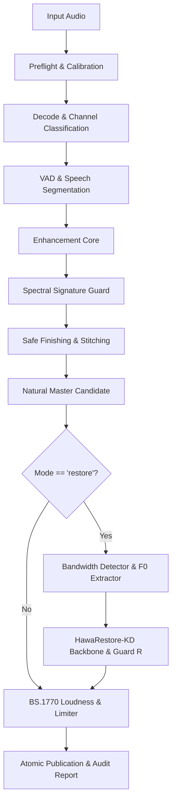

# 06 - Pipeline and Guard Integration

## Integration Architecture
Restoration is integrated as stage `10.5` in `src/hawavoclean/pipeline.py`.

## Guard R Decision Ladder
Candidates are generated at fractional generation strengths:
1. `strength = 1.0` (Full restored high-band)
2. `strength = 0.75` (Reduced restoration)
3. `strength = 0.50` (Conservative restoration)
4. `strength = 0.25` (Subtle high-band extension)
5. `strength = 0.0` (Pass-through of Natural-safe candidate)

If any guard metric (protected-band RMS error, high-frequency energy ratio, harmonic pitch divergence, speaker cosine similarity, or CTC posterior divergence) fails threshold evaluation, the policy automatically reverts to the highest passing lower strength, failing closed to `0.0`.
