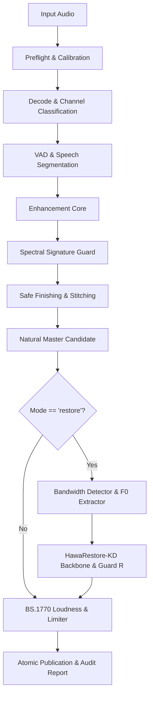

# 06 - Pipeline and Guard Integration

## Integration Architecture
Restoration is integrated as stage `10.5` in `src/hawavoclean/pipeline.py`.

## Guard R Decision Ladder

Candidates are generated at descending high-band strengths — 1.0, 0.75, 0.50,
0.25 — and evaluated strongest first. The first candidate to clear every layer is
accepted; the ladder is a descent toward a weaker proposal, not a vote.

Each candidate must pass all of: structural integrity (shape, finiteness, peak),
protected-band invariance, high-band event consistency, harmonic pitch
divergence, speaker cosine similarity against the profile prototype, and Sorani
acoustic-posterior divergence. Every layer is unconditional.

The ladder also carries a `strength = 0.0` entry, which *is* the Natural-safe
candidate. It is deliberately **not** evaluated: scoring the Natural audio against
itself would clear every layer trivially and return first, so a run in which every
real candidate was rejected would be audited as having passed the guard. It is
what the guard falls back *to*, never something the guard approves.

### Reported verdicts

| Verdict | Meaning | Audio shipped |
|---|---|---|
| `PASS` | Accepted at strength >= 0.75 | Restored candidate |
| `WARN` | Accepted at a reduced strength below 0.75 | Restored candidate |
| `FAIL` | Every active candidate rejected | Natural-safe master |
| `ERROR` | Restorer or guard raised | Natural-safe master |
| `NO_RESTORE` | Bypassed, or no active candidate offered | Natural-safe master |

A `FAIL` verdict carries the rejection reason and the failing layer's metrics, so
the report says *why* restoration was refused rather than only that it was.
